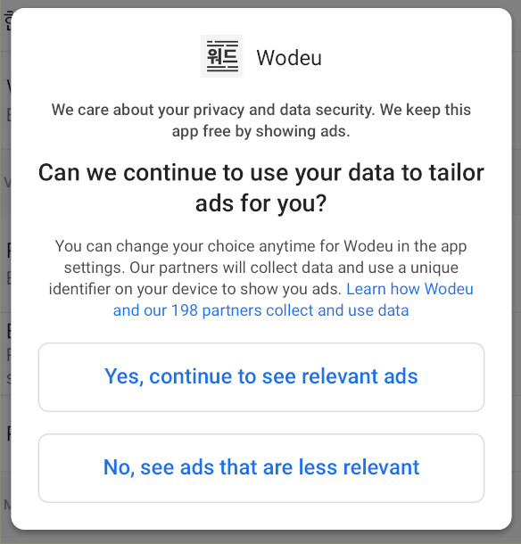

# Admob Consent Plugin


An extended wrapper for Google's Mobile Ads SDK in Flutter. Works on Android and iOS. The Android version has been modified to include localized consent forms.

## Usage
To use this plugin, add `admob_consent` as a [dependency in your pubspec.yaml file](https://flutter.io/platform-plugins/).

### Example

``` dart
import 'package:flutter/material.dart';
import 'package:admob_consent/admob_consent.dart';

final AdmobConsent _admobConsent = AdmobConsent();

_admobConsent.show(publisherId: "REPLACE_WITH_YOUR_PUBLISHER_ID", privacyURL: "URL_TO_YOUR_PRIVACY_POLICY");
```

### Publisher ID
Your publisher ID is the unique identifier for your AdMob account. [Find your publisher ID](https://support.google.com/admob/answer/2784578). It should look like this ```pub-XXXXXXXXXXXXXXXX```.

### Listener
You can listen to the ```onConsentFormLoaded```, ```onConsentFormOpened```, ```onConsentFormClosed``` and ```onConsentFormError``` streams.

``` dart
_admobConsent.onConsentFormClosed.listen((bool status) {
    // Status true if personalized
    // Handle it, ie. set targetingInfo
});
```

## Enjoy it?
<a href="https://www.buymeacoffee.com/AntegerDigital" target="_blank"></a>

## Troubleshooting
### Consent form does not show up in Android release builds
You most likely have to fiddle with proguards to keep some classes from being obfuscated or disable ```minifyEnabled```.

```
# Keep classes of this plugin
-keep class com.anteger.** { *; }

# Gson uses generic type information stored in a class file when working with fields. Proguard
# removes such information by default, so configure it to keep all of it.
-keepattributes Signature

# For using GSON @Expose annotation
-keepattributes *Annotation*

# Gson specific classes
-dontwarn sun.misc.**
#-keep class com.google.gson.stream.** { *; }

# Application classes that will be serialized/deserialized over Gson
-keep class com.google.gson.examples.android.model.** { <fields>; }

# Prevent proguard from stripping interface information from TypeAdapter, TypeAdapterFactory,
# JsonSerializer, JsonDeserializer instances (so they can be used in @JsonAdapter)
-keep class * implements com.google.gson.TypeAdapter
-keep class * implements com.google.gson.TypeAdapterFactory
-keep class * implements com.google.gson.JsonSerializer
-keep class * implements com.google.gson.JsonDeserializer

# Prevent R8 from leaving Data object members always null
-keepclassmembers,allowobfuscation class * {
  @com.google.gson.annotations.SerializedName <fields>;
}
```

## Screenshot

